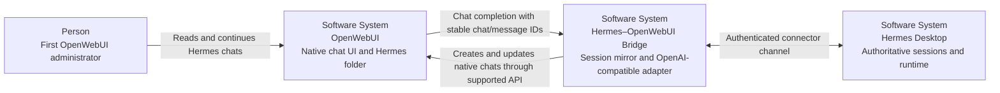
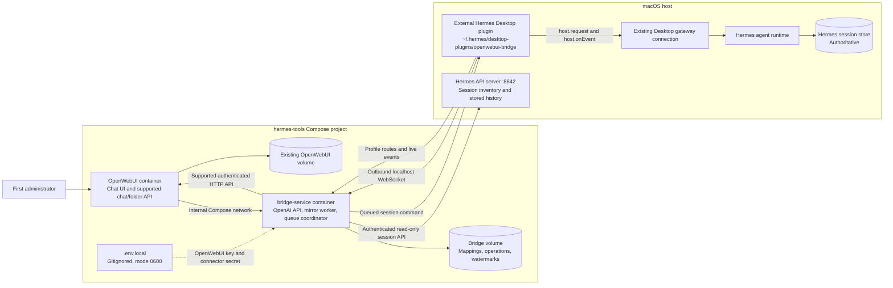
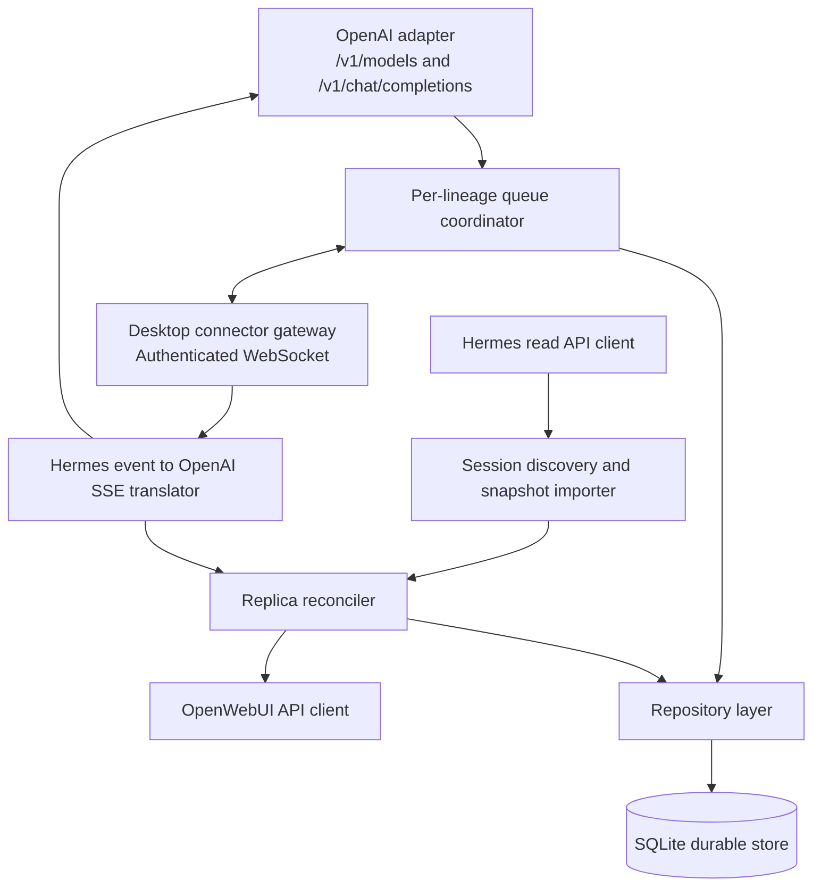

# Hermes–OpenWebUI Live Session Bridge Design

## Status

Approved in conversation on 2026-09-03, pending review of this written specification.

## Goal

Make every user-visible Hermes Desktop session appear automatically as a native OpenWebUI chat and allow OpenWebUI to continue the same Hermes session ID without reopening it or creating an independent agent runtime.

Hermes Desktop remains the owner of the live runtime and must be running before OpenWebUI can submit a turn. OpenWebUI is an alternate client and searchable replica, not a second source of session truth.

## MVP Scope

The first version will:

- discover all non-hidden sessions shown by the normal Hermes Desktop session inventory, across its registered local profiles;
- create and maintain native OpenWebUI chats owned by the first OpenWebUI administrator;
- place mirrored chats in a built-in OpenWebUI folder named `Hermes`;
- mirror Hermes titles and message histories into those chats;
- route a new OpenWebUI message to the mapped, existing Hermes lineage;
- queue a turn behind an already-running turn instead of interrupting it;
- stream Hermes response events back to the initiating OpenWebUI request;
- reconcile the OpenWebUI replica after reconnects and completed turns;
- preserve mappings, delivery state, and replay watermarks across container restarts;
- expose connector, queue, and synchronization health through the existing runner workflow.

Creating a new Hermes session from a brand-new OpenWebUI chat is explicitly deferred. It is the first planned post-MVP capability.

## Non-goals

The MVP will not:

- run or resume a Hermes session independently while Hermes Desktop is closed;
- connect directly to the Desktop runtime's ephemeral port or scrape its bearer token;
- write directly to the Hermes or OpenWebUI SQLite databases;
- propagate OpenWebUI edits or deletes of historical messages back to Hermes;
- provide multi-user ownership or sharing of mirrored sessions;
- mirror hidden sessions that are absent from Hermes Desktop's normal session inventory;
- forward OpenWebUI uploads, voice input, image input, or arbitrary OpenAI tool-call requests to Hermes;
- guarantee transparent recovery from an ambiguous submit that Hermes accepted but did not acknowledge;
- replace OpenWebUI's normal chat UI with a custom Hermes page or sidebar.

## Architectural Drivers

1. **Session identity:** a turn must continue the mapped Hermes lineage, not reconstruct context from an OpenAI request body.
2. **Desktop ownership:** the existing Desktop gateway connection owns the retained agent and its event transport.
3. **Update safety:** Hermes is installed and updated independently, so integration code must use its external plugin loader rather than patch installed files.
4. **No split-brain history:** Hermes is authoritative; OpenWebUI is a projection.
5. **At-most-once bias:** ambiguous delivery must not automatically create duplicate user turns.
6. **Local security:** long-lived credentials stay in server-side or local-only files and never enter the browser.
7. **Operational simplicity:** the existing Dock runner starts and stops the complete Compose stack.

## System Context — C4 Level 1



## Containers — C4 Level 2



Only the Desktop connector endpoint is published to `127.0.0.1`; OpenWebUI uses the bridge over the private Compose network. The existing OpenWebUI port remains `11001`.

## Bridge Components — C4 Level 3



### OpenAI adapter

Exposes one model, initially `hermes-live`. It accepts text-only OpenAI-compatible completion requests from OpenWebUI but does not replay the supplied conversation into Hermes. It selects the newest user text and uses stable OpenWebUI identifiers from headers:

```text
X-Hermes-Chat-Id: {{CHAT_ID}}
X-Hermes-User-Message-Id: {{USER_MESSAGE_ID}}
X-Hermes-Assistant-Message-Id: {{MESSAGE_ID}}
```

The operation key uses the chat and user-message IDs; the assistant-message ID identifies the OpenWebUI response node. Missing or unmapped chat IDs are rejected in the MVP; they do not create a new Hermes session. Unsupported multimodal inputs fail validation instead of silently dropping content.

### Desktop connector gateway

Accepts one authenticated outbound connection from the installed Desktop plugin. The plugin uses the supported external Desktop-plugin SDK:

- `host.profileRoutes()` and `host.listPersistedSessions()` for inventory;
- `host.request()` or the profile-routed equivalent for session RPC;
- `host.onEvent()` for message, reasoning, tool, error, and session events;
- a retained, Desktop-owned gateway route while a mapped turn is active.

The bridge never opens a second raw connection to the ephemeral Hermes runtime. A second transport can rebind output ownership away from Desktop, which would violate simultaneous rendering in both clients.

### Queue coordinator

Maintains a FIFO queue per Hermes lineage. Different lineages may execute concurrently. A queued operation is persisted before it is offered to the plugin. The plugin submits with Hermes queue semantics (`queued: true`) and reports acceptance separately from completion.

### Discovery and reconciliation

Bridge reads the complete user-visible session inventory and paginated stored messages through Hermes's authenticated `/api/sessions` and `/api/sessions/{id}/messages` endpoints on port `8642`. This supported API owns access to Hermes storage, so bridge never reads `state.db` directly and does not resume every session merely to import history. The Desktop plugin supplies credential-free profile-route descriptors for live commands and forwards runtime events. Bridge performs an idempotent upsert into OpenWebUI. Live events accelerate updates, but read-API snapshots remain authoritative and repair gaps.

Reconciliation runs:

- after Desktop plugin connection or reconnection;
- after a Hermes turn reaches a terminal event;
- when a replay gap is detected;
- periodically as a safety net.

## Data Ownership and Persistence

Hermes owns:

- session lineage and current stored-session tip;
- message history and ordering;
- titles, model/tool state, compression, and runtime status;
- the final truth about whether a turn exists.

OpenWebUI owns:

- the first-administrator account and API key;
- native presentation records used by its sidebar, search, folder, and chat UI;
- transient browser state.

The bridge owns:

- mapping from OpenWebUI chat UUID to Hermes profile, lineage root, and current stored-session tip;
- the OpenWebUI `Hermes` folder ID;
- per-session history/event watermarks;
- durable operation and queue state;
- deterministic Hermes-message to OpenWebUI-message IDs;
- connector epoch and replay position.

The bridge database is mounted on a dedicated named Docker volume. OpenWebUI's existing `hermes_open-webui` volume is preserved unchanged.

### Minimum mapping record

```text
openwebui_chat_id
hermes_connection_id
hermes_profile
hermes_lineage_root_id
hermes_stored_session_id
last_hermes_message_id
last_event_seq
last_snapshot_hash
created_at
updated_at
```

The lineage root is stable. `hermes_stored_session_id` is updated when Hermes compression or continuation rotates the durable tip.

### Operation states

```text
pending -> offered -> accepted -> streaming -> completed
                    \-> delivery_uncertain
          \-> rejected
```

An operation key is derived from the OpenWebUI chat and message IDs. Repeating a request with the same key returns or follows the existing operation rather than dispatching a second turn.

## End-to-end Flows

### Initial session import

1. The Desktop plugin connects and reports its connector version and available profile routes.
2. Bridge requests all user-visible persisted sessions and paginated messages through the authenticated Hermes read API.
3. Bridge ensures a native OpenWebUI folder named `Hermes` exists for the API-key owner.
4. For every unknown Hermes lineage, bridge creates a native OpenWebUI chat through `/api/v1/chats/new`. Bulk `/import` is not part of the normal path because it requires an additional import permission and still assigns a new OpenWebUI chat ID.
5. Bridge stores the returned OpenWebUI chat ID and assigns the chat to the `Hermes` folder.
6. Imported chats use the `hermes-live` model and retain the Hermes timestamps and title where the supported OpenWebUI API allows it.
7. Subsequent scans update the existing chat; they never create a second chat for the same lineage.

### Submit from OpenWebUI

1. OpenWebUI persists the user's new message and calls bridge `/v1/chat/completions`.
2. Custom headers identify the OpenWebUI chat and assistant message attempt.
3. Bridge resolves the mapping, derives the operation key, and persists a `pending` operation.
4. If Desktop is connected, the per-lineage coordinator offers the operation to the plugin; otherwise it rejects the interactive request with `503 Hermes Desktop offline` and leaves no silently queued user turn.
5. The plugin resumes or attaches the stored Hermes session on the existing Desktop-owned route and submits only the new user text with `queued: true`.
6. Hermes acceptance moves the operation to `accepted`; events stream through the plugin and bridge to OpenWebUI as OpenAI SSE chunks. While an accepted request waits behind a busy turn, bridge emits transport heartbeats so proxy timeouts do not look like a failed delivery.
7. A terminal event completes the SSE response and triggers snapshot reconciliation.

### Turn initiated in Hermes Desktop

1. The Desktop plugin observes events on the existing gateway stream.
2. Events update bridge watermarks but do not require an OpenWebUI completion request.
3. At turn completion, bridge fetches a fresh Hermes snapshot.
4. Reconciler appends or repairs the corresponding native OpenWebUI history.
5. After persisting an update, bridge uses OpenWebUI's supported message-event endpoint to emit `chat:reload`. An already-open browser chat reloads its canonical history, while the normal chat-list refresh shows the updated title and timestamp.

### Reconnect and replay

1. Every Desktop plugin connection has a new connector epoch.
2. Bridge requests events since the stored sequence where Hermes replay supports it.
3. If replay is complete, bridge advances the watermark.
4. If replay is truncated or unavailable, bridge discards no data and reconciles from a full session snapshot.
5. Operations that were offered but not acknowledged become `delivery_uncertain`; they are never automatically resubmitted before history reconciliation proves absence.

## Synchronization Rules

- Hermes is authoritative when histories differ.
- Hermes-to-OpenWebUI synchronization includes titles, messages, and ordering.
- OpenWebUI historical edits, deletes, and renames do not propagate to Hermes.
- A later Hermes reconciliation may overwrite those local changes.
- Bridge-generated OpenWebUI message IDs are deterministic so repeated reconciliation is idempotent.
- An error syncing one chat is isolated and retried without blocking other lineages.
- OpenWebUI's request body history is display state, not Hermes context.
- The bridge does not infer a successful Hermes submit solely from matching text when identity is ambiguous.

## Security and Trust Boundaries

### Local configuration

Tracked `.env.example` documents variables without values. Gitignored `.env.local` contains local credentials and is created with mode `0600`:

```dotenv
OPENWEBUI_API_KEY=
HERMES_BRIDGE_SECRET=
BRIDGE_HOST_PORT=8787
BRIDGE_LOG_LEVEL=info
```

The user manually enables OpenWebUI API keys, creates one for the first administrator, and places it in `.env.local`. This avoids a custom OpenWebUI authentication patch. The key is supplied only to bridge-service and is never forwarded to Hermes or a browser.

`make bootstrap` generates `HERMES_BRIDGE_SECRET` when absent. `make install-plugin` installs a local Desktop plugin copy with the connector credential injected into the installed, mode-`0600` artifact. The tracked plugin source and build output contain no credential. This duplicates the secret only into a file readable by the same macOS user who can already read `.env.local`.

The existing Hermes `API_SERVER_KEY` continues to come from `/Users/frenzy/.hermes/.env` and is supplied only to bridge-service for the read-only session API. It is not copied into `.env.local` or the Desktop plugin.

### Network exposure

- OpenWebUI remains published on `localhost:11001`.
- Bridge's OpenAI endpoint is consumed over the private Compose network.
- The Desktop connector WebSocket is published only on `127.0.0.1:${BRIDGE_HOST_PORT}`.
- Connector authentication is required before inventory, commands, or events are accepted.
- Hermes Desktop gateway URLs, internal bearer tokens, and the OpenWebUI API key never appear in bridge responses or logs.

### Logging

Logs contain operation IDs, public chat/session correlation IDs, state transitions, and error categories. They redact authorization headers, API keys, connector secrets, prompt content by default, and tool payloads. Debug prompt logging is out of scope for the MVP.

## Manual OpenWebUI Configuration

The one-time setup is intentionally explicit:

1. Sign in as the first OpenWebUI administrator.
2. Enable API keys and create a key for that account.
3. Put the key into `hermes-tools/.env.local` as `OPENWEBUI_API_KEY`.
4. Configure the Hermes connection to use bridge-service's `/v1` URL.
5. Configure `X-Hermes-Chat-Id: {{CHAT_ID}}`, `X-Hermes-User-Message-Id: {{USER_MESSAGE_ID}}`, and `X-Hermes-Assistant-Message-Id: {{MESSAGE_ID}}` as connection custom headers.

The repository will document the exact UI path for the pinned OpenWebUI revision. No password, JWT session cookie, or API key is committed.

## Failure Handling

| Condition | Behavior |
|---|---|
| Hermes Desktop closed | Mirrored chats remain readable; interactive completion returns 503. |
| Desktop plugin disabled or disconnected | Same as Desktop offline; health reports connector offline. |
| Bridge unavailable | OpenWebUI reports provider failure; no direct fallback to Hermes API occurs. |
| OpenWebUI API key missing or invalid | Provider can report unhealthy; mirror worker pauses and reports an actionable error. |
| Session mapping missing | Completion is rejected; no new Hermes session is created in MVP. |
| Existing Hermes turn busy | New turn is submitted with explicit queue semantics and ordered per lineage. |
| Connector drops before acceptance | Operation may be retried only when it was never offered or acceptance is definitively absent. |
| Connector drops after offer but before acknowledgement | Mark `delivery_uncertain`, reconcile, and never blindly resubmit. |
| Event replay gap | Fetch a full Hermes snapshot and repair the OpenWebUI replica. |
| One chat cannot sync | Record per-chat failure and continue syncing other chats. |
| Runner quits normally | `docker compose stop` stops OpenWebUI and bridge without deleting volumes. |

## Health and Observability

Bridge provides:

- liveness: process and database available;
- readiness: OpenWebUI credentials valid and Desktop plugin connected;
- connector status: version, epoch, last heartbeat, profile count;
- queue status: pending, active, uncertain, and failed counts;
- mirror status: last full scan, last successful reconciliation, per-chat failures.

`make status` checks both Compose services and summarizes bridge readiness without printing secrets. OpenWebUI may remain healthy while Hermes completion readiness is offline.

## Repository Structure

```text
hermes-tools/
├── .env.example
├── .env.local                    # ignored
├── bridge-service/
│   ├── Dockerfile
│   ├── pyproject.toml
│   ├── src/hermes_bridge/
│   │   ├── api/                  # OpenAI and health endpoints
│   │   ├── connector/            # Desktop WebSocket protocol
│   │   ├── domain/               # mappings, operations, queue rules
│   │   ├── hermes/               # event and snapshot contracts
│   │   ├── openwebui/            # supported API client and translation
│   │   └── persistence/          # SQLite repositories and migrations
│   └── tests/
├── hermes-plugin/
│   ├── src/plugin.js             # credential-free source
│   ├── scripts/install.sh        # renders local installed artifact
│   └── tests/
├── open-webui/                   # pinned fork submodule
├── compose.yaml
├── runner/
└── tests/
```

The bridge uses ports-and-adapters boundaries: queue and synchronization rules do not import FastAPI, WebSocket, SQLite, or OpenWebUI client details. This allows unit tests to use fake ports and keeps protocol changes localized.

## Protocol Versioning

The Desktop connector begins every connection with a versioned `hello` frame containing connector version and supported capabilities. Bridge rejects incompatible major versions and feature-detects optional minor capabilities.

Command and event envelopes contain:

```json
{
  "protocol": 1,
  "kind": "command-or-event-name",
  "id": "uuid",
  "correlation_id": "uuid",
  "sent_at": "RFC3339 timestamp",
  "payload": {}
}
```

Heartbeat, bounded message size, schema validation, and explicit command acknowledgement are mandatory. Prompt text is accepted only in the submit command; arbitrary Hermes RPC forwarding is forbidden. The connector allowlist initially contains inventory, snapshot, attach/resume, queued submit, replay, and status operations.

## Verification Strategy

### Unit tests

- stable lineage/chat mapping and rotated Hermes stored-session tips;
- deterministic message IDs and idempotent reconciliation;
- per-lineage FIFO ordering and cross-lineage concurrency;
- duplicate OpenWebUI completion requests;
- all operation-state transitions, including uncertain delivery;
- snapshot-to-OpenWebUI history translation;
- connector authentication and protocol-version rejection;
- log redaction.

### Contract tests

- recorded Hermes Desktop SDK/RPC event fixtures;
- OpenWebUI chat import, update, folder, and authentication behavior for the pinned submodule revision;
- OpenWebUI `chat:reload` delivery after an API-originated history update;
- OpenAI SSE framing expected by OpenWebUI;
- `.env.local` exclusion and `.env.example` completeness.

### Integration tests

- bridge plus fake Desktop connector plus disposable OpenWebUI data volume;
- initial import produces exactly one native chat per Hermes lineage;
- Desktop-originated turns appear in the mirror;
- OpenWebUI-originated turns target the mapped session and queue while busy;
- bridge and connector restart recover mapping and watermarks;
- replay truncation triggers snapshot repair;
- normal runner quit preserves both named volumes.

### Manual acceptance

1. Start Hermes Desktop and open an existing session.
2. Start the Dock runner.
3. Confirm every normal Hermes session appears once in OpenWebUI's `Hermes` folder.
4. Open the same session in both clients.
5. Submit from OpenWebUI while Hermes is idle and while it is already generating.
6. Confirm both clients show the same ordered final transcript without reopening the session.
7. Submit from Desktop and confirm OpenWebUI updates after reconciliation.
8. Restart the bridge and then the whole Compose stack; confirm mappings and histories remain stable.
9. Quit Hermes Desktop; confirm history remains readable and submit fails explicitly without creating a second runtime.

## Architecture Decisions

### ADR-001: Use an external Desktop plugin rather than patching Hermes

**Context:** Hermes is installed and updated outside this repository. A raw second gateway transport can steal live output ownership.

**Options:** patch/fork Hermes; connect directly to the internal runtime; use the supported on-disk Desktop plugin SDK.

**Decision:** use the standalone plugin door at `~/.hermes/desktop-plugins/openwebui-bridge/plugin.js`, which hot-loads through the installed plugin host and acts through the Desktop-owned gateway. The standalone location is chosen over the unified agent-plugin location because it needs no Python half and does not add a separate enablement step.

**Consequences:** Hermes updates do not overwrite bridge code, and Desktop retains event ownership. Compatibility must be contract-tested against the installed SDK.

### ADR-002: Keep Hermes authoritative and OpenWebUI as a native replica

**Context:** Both products have their own chat storage, but only Hermes owns the live agent state.

**Options:** bidirectional multi-master sync; custom read-only Hermes UI inside OpenWebUI; native OpenWebUI chats reconciled from Hermes.

**Decision:** materialize native OpenWebUI chats and reconcile them one-way from Hermes, with a single controlled new-message command path in the other direction.

**Consequences:** existing OpenWebUI UI features work without a custom sidebar. Historical edits made only in OpenWebUI are not durable and may be overwritten.

### ADR-003: Use a separate bridge service and durable store

**Context:** OpenAI adaptation, synchronization, idempotency, and queueing must outlive a browser or plugin reconnect.

**Options:** put all logic in the Desktop plugin; put all logic in OpenWebUI; run a separate service.

**Decision:** run bridge-service in the existing Compose project with its own named volume.

**Consequences:** domain logic and recovery are independently testable, but the stack gains one service and one small database.

### ADR-004: Use standard OpenWebUI API-key authentication

**Context:** Background sync must act as the owner of native OpenWebUI chats.

**Options:** custom privileged OpenWebUI endpoint; automate password/JWT login; manually create a first-admin API key.

**Decision:** the user creates the key once in OpenWebUI and stores it in ignored `.env.local`.

**Consequences:** no additional authentication patch is required. Setup has one manual step and the key must be rotated deliberately.

### ADR-005: Prefer non-duplication over automatic ambiguous retries

**Context:** a disconnect can occur after Hermes accepted a turn but before bridge received acknowledgement.

**Options:** always retry; never recover; persist an operation state and reconcile before any retry.

**Decision:** mark ambiguous operations `delivery_uncertain`, reconcile against Hermes, and retry only after proving the turn was not accepted.

**Consequences:** duplicate turns are avoided. Rare ambiguous operations may require visible operator action if Hermes cannot provide identity proof.

### ADR-006: Read stored history through Hermes API and execute through Desktop plugin

**Context:** importing every persisted transcript by resuming it would create unnecessary runtimes, while direct database access would bypass Hermes ownership. The public Hermes API can safely expose stored history but cannot safely share a retained Desktop agent's in-memory transport.

**Options:** read `state.db` directly; resume every session through the plugin; split the read and execution paths along supported ownership boundaries.

**Decision:** use authenticated Hermes HTTP endpoints for session inventory and stored-message snapshots, and use the Desktop plugin exclusively for profile routing, live submit, event fan-out, and replay.

**Consequences:** initial import is read-only and bounded by API pagination. Bridge must reconcile stored snapshots with newer live events, and both the Hermes API server and Desktop plugin are readiness dependencies for full operation.

## Compatibility and Upgrade Policy

- `open-webui` remains pinned as a Git submodule; upgrades are rebased from `upstream` and verified by contract tests before the pointer moves.
- The Hermes plugin protocol is versioned and feature-detects SDK capabilities.
- No installed Hermes source file is changed.
- If Hermes removes or changes required SDK methods, bridge readiness fails closed and reports the incompatible capability instead of falling back to raw runtime credentials.
- The OpenWebUI API key is revocable independently of Hermes and the connector secret.

## Deferred Work

After the MVP is stable:

1. Create a new Hermes session from a new OpenWebUI chat.
2. Add an unobtrusive Hermes badge and richer connector status in OpenWebUI.
3. Support archived/hidden-session policies.
4. Support multiple OpenWebUI users with explicit ownership mapping.
5. Add deliberate rename/edit/delete propagation where Hermes APIs can express it safely.
6. Replace local static connector credentials with short-lived pairing tickets if the deployment expands beyond one trusted macOS account.
