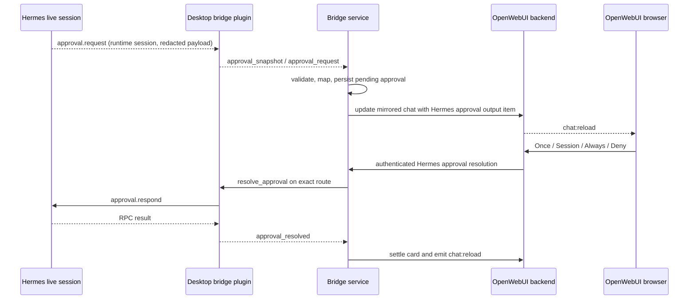

# Hermes approval bridge design

Date: 2026-09-07
Status: approved in conversation; awaiting review of this written specification

## Purpose

Make every approval that blocks a live Hermes Desktop session visible and actionable in its mirrored OpenWebUI chat. OpenWebUI must offer the complete set of choices allowed by Hermes: `once`, `session`, `always`, and `deny`. A decision made in either OpenWebUI or Hermes Desktop must update the other surface without reopening or taking ownership of the session.

The first acceptance target is the already-live stored session `20260907_133115_1d5b61`, which currently has a pending approval visible only in Hermes Desktop.

## Scope

This change includes:

- live forwarding and replay-safe discovery of Hermes approvals;
- durable approval state in the bridge;
- a native-looking approval card in OpenWebUI;
- authenticated delivery of a choice back to the exact Hermes profile route;
- automatic settlement when the approval is resolved from Hermes Desktop;
- contract, service, backend, and frontend tests;
- rollout changes in the existing Docker Compose stack and Desktop plugin.

This change does not:

- patch the installed Hermes application or Hermes Python source;
- resume inactive sessions merely to look for approvals;
- execute a Hermes approval as an OpenWebUI tool;
- expose arbitrary Hermes RPC methods through the connector;
- make OpenWebUI authoritative for session or transcript state;
- add support for unrelated blocking prompts such as sudo, secret, MCP setup, or clarification requests.

## Confirmed root cause

The Desktop plugin subscribes to all host events but forwards only an explicit allowlist. `approval.request` is absent from that allowlist. The bridge protocol's event literal and normalized event enum omit it as well, so the event cannot reach synchronization or mirroring.

OpenWebUI already renders pending function calls with Allow and Deny actions, but its generic resolver resumes OpenWebUI's own tool execution pipeline. Treating a Hermes approval as an ordinary function call would cause OpenWebUI to try to execute a local tool instead of calling Hermes `approval.respond`. The integration therefore needs an explicit Hermes approval path.

Hermes exposes the supported RPC methods needed by the plugin:

- `session.active_list` lists live runtime sessions without resuming them;
- `approval.pending` returns unresolved approvals for a live session;
- `approval.respond` resolves a specific request with a choice.

Hermes emits `approval.request`, but does not emit a corresponding Desktop gateway event when another surface resolves it. The bridge must therefore reconcile pending state after the initial event.

## Design principles

1. **Hermes stays authoritative.** The bridge projects approval state and relays choices; it never decides whether a choice is allowed.
2. **No session ownership change.** Discovery uses live-session inspection only. It never calls `session.resume`.
3. **Exact route delivery.** Every query and response uses the full Desktop route descriptor: connection, source profile, and target profile.
4. **Fail closed.** Unknown, stale, mismatched, or repeated choices do not reach Hermes.
5. **Supported boundaries only.** The bridge uses the Desktop plugin SDK and Hermes RPC. It does not read Hermes or OpenWebUI SQLite directly.
6. **No secret reflection.** Only Hermes-redacted command text is accepted. Approval payloads and command text are not written to logs.
7. **Repairable projection.** Live events accelerate updates; successful approval snapshots and authoritative session history repair missed events.

## Architecture



There are three cooperating changes:

- **Desktop plugin:** discovers, sanitizes, forwards, and resolves Hermes approvals using fixed RPC methods.
- **Bridge service:** owns durable identity, authorization, reconciliation, and OpenWebUI projection.
- **OpenWebUI fork:** renders the full Hermes choice set and delegates Hermes cards to the bridge instead of its local tool runner.

## Desktop plugin behavior

### Immediate event forwarding

`approval.request` joins the plugin's explicit event allowlist. The plugin forwards only these fields:

- exact route descriptor;
- runtime session ID;
- sequence number when Hermes supplies one;
- request ID;
- stored session ID when already known;
- description;
- Hermes-redacted command text;
- `allow_permanent`, `smart_denied`, and the explicit `choices` list.

Unknown fields are discarded rather than reflected across the socket.

An approval event causes the bridge to request an immediate approval scan for its route. This enriches an event that contains only a runtime ID with the stored `session_key` from `session.active_list`.

### Discovery and reconciliation

On connector authentication and periodically while connected, the bridge issues a typed scan command per available route. The plugin performs this bounded scan:

1. call `session.active_list`;
2. inspect only live rows whose status is `waiting`;
3. call `approval.pending` for those runtime session IDs;
4. return one complete snapshot for the route.

The scan must not return message previews or unrelated session fields. A successful snapshot identifies its route and contains sanitized live-session identities plus pending approval records. Live-session identities contain only runtime ID, stored session ID, and status; they let the bridge distinguish an externally resolved approval from a vanished runtime. A failed or partial scan must be an error frame, never an empty snapshot, so the bridge cannot confuse failure with resolution.

The default safety scan interval is two seconds. Immediate event delivery remains the normal fast path. The bridge schedules scans only while the connector is authenticated, and the plugin coalesces overlapping scans.

### Resolving a choice

The connector accepts a fixed `resolve_approval` command containing:

- bridge approval ID;
- exact route descriptor;
- runtime and stored session IDs;
- Hermes request ID;
- one of `once`, `session`, `always`, or `deny`.

The plugin retains the exact route for the request, invokes `approval.respond`, and returns a typed result. The stored session ID and request ID remain available to Hermes's existing stale-runtime fallback. The connector cannot be instructed to invoke another RPC method.

## Connector protocol

Protocol version 1 is extended compatibly with a declared `approvals_v1` capability. A bridge that requires approval support must verify that capability before enabling the OpenWebUI controls.

New typed frames:

- `approval_request`: unsolicited event-shaped fast path;
- `approval_scan`: bridge command requesting a complete route snapshot;
- `approval_snapshot`: complete successful snapshot for one route;
- `resolve_approval`: bridge command carrying a validated choice;
- `approval_resolved`: typed RPC result;
- existing `command_error`: safe failure result without raw Hermes error reflection.

Every command keeps the existing correlation ID, size bound, authentication, route validation, and pending-command cleanup rules.

## Bridge domain model

The bridge adds a durable `pending_approval` record with:

- stable bridge approval ID;
- lineage key and OpenWebUI chat ID;
- exact route descriptor;
- stored and runtime session IDs;
- Hermes request ID;
- redacted command and description;
- allowed choices;
- state;
- known resolved choice when the bridge delivered it;
- creation and update timestamps.

The stable ID is derived from route identity, stored session lineage, and Hermes request ID. It is not supplied by OpenWebUI and does not contain the command text.

States are:

```text
pending -> resolving -> resolved
                   \-> pending              (known non-acceptance)
                   \-> delivery_uncertain -> pending / resolved / resolved_external
pending -----------> resolved_external
pending -----------> expired
```

- `resolved` includes the choice delivered through this bridge.
- `delivery_uncertain` disables all controls until a successful snapshot proves whether Hermes accepted the response.
- `resolved_external` means a later successful Hermes snapshot proved that the request is no longer pending while its live session still exists. The exact choice is intentionally reported as unknown.
- `expired` means the live session disappeared before a resolution could be proven.

Absence counts as resolution only in a complete successful snapshot for the same exact route. Connector loss, timeout, partial scan, or route removal never resolves a card.

## Mapping approval state to a chat

The bridge maps an approval by exact route plus stored session ID to the existing lineage mapping. If only the runtime ID is known, it waits for the enriched route snapshot rather than guessing. An unmapped approval triggers the normal session inventory scan and remains buffered within a strict bound until the mapping is available.

The mirror adds a stable bridge-owned assistant node when the canonical Hermes history does not yet contain a persisted assistant message for the running turn. Its `output` contains a dedicated Hermes function-call item with:

- provider marker `hermes`;
- bridge approval ID as call ID;
- display name and redacted arguments;
- explicit allowed choices;
- `pending`, `resolved`, `resolved_external`, `rejected`, or `expired` display state.

The node has `done: false` only while the approval is pending or resolving. It is recorded in `hermes_bridge_message_ids`, so normal reconciliation replaces it safely rather than treating it as local drift.

When the Hermes turn reaches a terminal event, canonical history is reconciled first. Any settled synthetic card already represented by canonical tool history is then removed. A still-pending approval is never removed solely because a message scan omitted it.

## OpenWebUI integration

### Frontend

The existing tool-call display gains an explicit Hermes approval variant. It renders only the choices present in the item:

- primary button: **Allow once**;
- menu item: **Allow for this session**;
- menu item: **Always allow**;
- destructive secondary button: **Deny**.

`Always allow` is hidden when Hermes omits it or `allow_permanent` is false. A Smart-denied request can therefore expose only `once` and `deny`.

While a choice is in flight, all controls are disabled. Settled cards show the known choice or **Resolved in Hermes Desktop** and cannot be submitted again.

### Backend

The existing chat-message resolution endpoint branches only when the selected output item has the validated Hermes provider marker. It then:

1. verifies chat ownership using the normal OpenWebUI rules;
2. loads the canonical message and matching call item;
3. validates that the item is pending and that the requested choice is allowed;
4. calls the bridge's internal approval endpoint with the chat ID, message ID, approval ID, and choice;
5. updates the stored output only after a confirmed bridge result;
6. emits `chat:completion`/`chat:reload` without invoking OpenWebUI's local tool executor or starting another model completion.

Ordinary OpenWebUI function calls keep their existing behavior unchanged.

The OpenWebUI container receives an internal bridge URL and the existing bridge secret through Docker Compose. The credential is never placed in chat variables, browser payloads, or logs.

## Bridge HTTP endpoint

The bridge exposes an authenticated internal endpoint dedicated to approval resolution. It accepts:

- OpenWebUI chat ID;
- OpenWebUI message ID;
- bridge approval ID;
- requested choice.

The bridge loads its own persisted record and verifies all identities. It never trusts runtime IDs, request IDs, routes, commands, or allowed choices supplied by OpenWebUI. A valid request is dispatched through the connected plugin.

Response rules:

- success: approval was resolved and the card state was persisted;
- `409`: already resolving or already settled;
- `410`: Hermes reports no matching pending request;
- `422`: choice is not in Hermes's allowed choice list;
- `503`: exact connector route is unavailable;
- `504`: delivery timed out without proof; state becomes `delivery_uncertain` until reconciliation.

An uncertain transport result is reconciled through `approval.pending` before another submission is allowed.

## Cross-surface settlement

When OpenWebUI resolves an approval, the bridge knows the exact choice and updates the card immediately.

When Hermes Desktop resolves it, the next complete plugin snapshot no longer contains that request. The bridge marks it `resolved_external`, updates the mirror, and emits `chat:reload`. Hermes does not expose the external choice on the Desktop gateway, so the UI must not guess whether it was allowed or denied.

If another approval follows in the same session, it receives a new stable ID and replaces or follows the settled card without reusing controls from the previous request.

## Security

- All connector and internal HTTP traffic is authenticated with the existing bridge secret.
- The internal resolution endpoint is not published as a separate host port.
- Route, chat, lineage, stored session, runtime session, request, and allowed choice are checked together.
- Only Hermes-redacted command text is stored and displayed.
- Command text and approval arguments are excluded from normal and error logs.
- `always` is accepted only when Hermes explicitly advertises it for that request.
- Repeated submissions are idempotently rejected and never become a second Hermes RPC call.
- The plugin exposes no generic RPC proxy.

## Failure handling

- **Plugin disconnected:** card stays pending but controls show the route as unavailable; no optimistic settlement.
- **OpenWebUI unavailable:** approval remains durable in the bridge and is projected on the next reconciliation.
- **Bridge restart:** persisted `resolving` approvals become `delivery_uncertain` and all persisted approvals are reconciled against a fresh complete route snapshot before controls are enabled.
- **Missed live event:** the two-second live-session scan discovers the pending request.
- **Missed resolution event:** successful snapshot absence settles the card as external.
- **Session closed:** card becomes expired after a successful scan proves the live runtime is gone.
- **Choice race between surfaces:** only Hermes's result is authoritative. One succeeds; the other receives stale/already-resolved state and refreshes.
- **Unsupported plugin version:** approvals remain non-actionable and readiness reports the missing capability.

## Observability

Health output adds aggregate approval metrics only:

- pending;
- resolving;
- resolved externally;
- failed reconciliation count;
- last successful approval scan timestamp.

No approval description, command, request ID, or session content appears in health or logs.

## Testing

### Desktop plugin tests

- `approval.request` is forwarded with an allowlisted sanitized payload;
- a route scan calls only `session.active_list` and `approval.pending` for waiting sessions;
- complete and failed snapshots are distinguishable;
- overlapping scans coalesce;
- resolution uses the exact retained route and fixed `approval.respond` RPC;
- unsupported or disallowed choices never reach the host;
- reconnect advertises `approvals_v1` and performs discovery.

### Bridge tests

- protocol validation for every new frame and invalid shape;
- stable approval identity and state transitions;
- runtime-to-lineage enrichment without guessing;
- pending card projection and bridge-owned message bookkeeping;
- full choice preservation and `always` suppression;
- resolution authorization, idempotence, route mismatch, timeout, and stale request behavior;
- successful snapshot absence produces `resolved_external`;
- failed/partial snapshots leave pending state unchanged;
- terminal transcript reconciliation removes only safely represented synthetic cards.

### OpenWebUI tests

- full four-choice rendering;
- reduced choice sets;
- disabled and settled states;
- Hermes resolution bypasses local tool execution and model completion;
- chat ownership and call identity validation;
- backend failure leaves the card pending and actionable;
- ordinary OpenWebUI approvals remain unchanged.

### Contract and acceptance tests

- a synthetic running Hermes session raises an approval and OpenWebUI receives a live card;
- each allowed choice reaches the fake Hermes RPC exactly once;
- a fake Desktop-side resolution settles the OpenWebUI card;
- connector restart rediscovers an already-pending approval;
- the existing session `20260907_133115_1d5b61` appears after rollout without a history reset or session resume;
- the real pending approval is not resolved automatically during acceptance; the user remains responsible for selecting the choice.

## Rollout

1. Add tests and implement the connector and bridge protocol behind `approvals_v1`.
2. Add persistence, synchronization, mirroring, and the internal bridge endpoint.
3. Add the OpenWebUI backend delegation and frontend card.
4. Rebuild the bridge and OpenWebUI images.
5. reinstall/reload the Desktop plugin;
6. verify connector capability, approval scan health, and current pending-card visibility;
7. let the user select the real approval choice and verify the resulting Hermes turn continues;
8. run the complete bridge, plugin, OpenWebUI targeted, and Docker contract suites.

No OpenWebUI history reset is required for this rollout.
